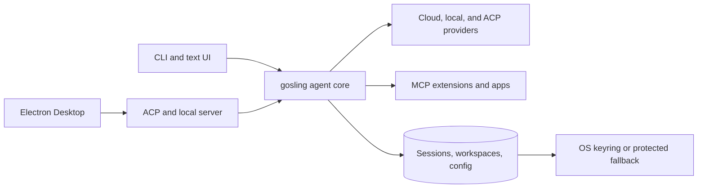

<div align="center">


# gosling

_an independently maintained native open source AI agent for code, workflows, and everything in between_

<p align="center">
  <a href="https://opensource.org/licenses/Apache-2.0"
    ></a>
</p>
</div>

gosling is a general-purpose AI agent that runs on your machine. Not just for code — use it for research, writing, automation, data analysis, or anything you need to get done.

A native desktop app for macOS, Linux, and Windows. A full CLI for terminal workflows. An API to embed it anywhere. Built in Rust for portability.

gosling works with 15+ providers — Anthropic, OpenAI, Google, Ollama, OpenRouter, Azure, Bedrock, and more. Use API keys or your existing Claude, ChatGPT, or Gemini subscriptions via ACP. Connect to 70+ extensions via the [Model Context Protocol](https://modelcontextprotocol.io/) open standard.

## Provenance

gosling is an independently maintained descendant of [goose](https://github.com/aaif-goose/goose) **v1.38**, the open source AI agent from the [Agentic AI Foundation (AAIF)](https://aaif.io/) at the Linux Foundation. The inherited framework and commit history remain credited to the goose project and its contributors. gosling is licensed under Apache 2.0 and is not endorsed by or affiliated with goose, AAIF, or the Linux Foundation. See [CONTRIBUTORS.md](CONTRIBUTORS.md) for the independent-fork boundary and attribution details.

## Vision

gosling is maintained as an independently branded descendant of goose. It is
intended to offer a focused surface that can run alongside goose and be remixed
for custom distributions.

### Key Security Hardening

Relative to the inherited baseline, gosling implements several safety and security hardening improvements:

* **Fail-Closed Tool Inspection**: In upstream, if a tool inspector encountered an error (e.g., timeout, network issue, or internal error), it logged the error and allowed the loop to continue. Because the permission baseline in auto-approval mode is `Allow`, a failing safety inspector would silently let tools execute ungated. Gosling fixes this by synthesizing a `RequireApproval` safety action when a tool inspector fails, forcing execution to halt for manual human approval.
* **Confined MCP Cache Tool Paths (Directory Traversal Hardening)**: Restricts the MCP `cache` command to the sandbox/cache directory via path canonicalization and membership verification, preventing directory traversal injections from reading or deleting files outside the sandbox.
* **Restricted File & Directory Permissions**: 
  - Enforces safe file permissions (`0o600`) for token and session files containing sensitive API keys and OAuth tokens.
  - Restricts the session database directory (`sessions.db` along with SQLite `-wal` and `-shm` sidecar files) to owner-only access (`0o700`), keeping conversation history and echoed secrets protected from other local users.
* **Option Injection Protection**: Added `--` end-of-options guards to `git clone` during plugin installation, preventing command/option injection attacks via malicious URL strings starting with a hyphen.
* **Safer Defaults for Agent Execution**: Tightened default agent permissions and fail-safe paths around code execution, provider configuration, and security scanning so uncertain states move toward review instead of silent execution.

### Feature comparison (Goose v1.47.0 vs. gosling v1.1.0)

This compatibility view is source-based: Goose is the `v1.47.0` release tag and
gosling is the local `v1.1.0` source. It is not a benchmark, certification, or
claim of exact behavioral parity. See the [detailed compatibility guide](documentation/docs/guides/goose-v1-47-compatibility.md).

| Feature | Goose | Gosling | Notes |
|---|---|---|---|
| **Core AI Agent Engine** | Yes | Yes | Both support standard LLM chat and tool-calling loops. |
| **Model Context Protocol (MCP)** | Yes | Yes | Supports MCP and discovers a catalog of 70+ external extensions; compatibility varies by server, transport, and platform and is not exhaustively certified. |
| **Cloud Providers** | 15+ | 15+ | Anthropic, OpenAI, Gemini, Ollama, OpenRouter, Azure, Bedrock, etc. |
| **Local Inference/Models** | **Yes** | **No** | Goose bundles candle, MLX, llama.cpp, and Hugging Face loaders. Gosling does not include these loaders. |
| **CLI Command Suite** | `goose`, `goose serve`, `recipe`, `schedule`, `gateway`, `local-models` | `gosling`, `gosling serve` | Gosling drops `recipe`, `schedule`, `gateway`, and `local-models` subcommands. |
| **Coexistence** | No | **Yes** | Gosling runs side-by-side with Goose using isolated configs, databases, keyring, and deep links. Shared AAIF paths such as `~/.agents` remain intentionally interoperable. |
| **Context Manager MVP** | No | **Yes** | Gosling features an MVP context manager with localized LLM summarization and a `FileMemorySource` backend for retrieved memory. |
| **Fail-Closed Tool Inspection** | No | **Yes** | Gosling escalates safety/security inspector failures to RequireApproval. Goose fails open. |
| **Path Sandbox Enforcement** | Weak | **Yes** | Gosling restricts directory traversals (`../`) in cache extension paths. |
| **Desktop Git branch indicator** | Yes | **Yes** | Displays the current branch for the selected, renderer-authorized working directory; gosling supports local-branch switching. |
| **Pre-registered OAuth for Streamable HTTP MCP** | Yes | **Yes** | `client_id`, `client_secret_key`, and `scopes` configure static OAuth clients. The secret is resolved from an extension environment or gosling’s secret store, never inline. |
| **Recently used model picker** | Yes | **Yes** | Desktop retains up to five prior successful model/provider selections and exposes them above Change Model. |

## What's included

- **Workspace-aware Desktop chats** - workspace rows filter the chat list without changing the default for future chats. Starting a chat from a workspace action preselects that workspace, while the global New Chat flow preselects the active/default workspace and still allows a per-chat override.
- **Credential profiles in chat** - the chat composer exposes the credential-profile selector and manager, shows a session's pinned profile, and keeps missing-profile failures visible instead of silently choosing another credential.
- **Desktop lifecycle and windowing reliability** - startup, shutdown, backend cleanup, single-instance behavior, packaged loopback connectivity, and native multi-window actions have dedicated repair and replay evidence.
- **Session and CLI correctness** - persisted interrupted turns, provider failures, machine-readable output, malformed configuration, doctor behavior, empty-input rejection, and ACP lifecycle handling were repaired through the 2026-07-20 playtest campaign.
- **Context and memory** - local summarization, durable file-backed facts, backend-specific routing, compacted-session resume paging, and bounded handoff design support longer-running work.
- **Security hardening** - tool inspection fails closed, secret and session storage use restricted permissions, sensitive writes are atomic, provider clients are bounded, and plugin/cache/path handling rejects unsafe inputs.
- **ACP, MCP, and provider integration** - custom ACP requests, MCP app proxy routes, generated SDK/OpenAPI surfaces, external extensions, and subscription-backed provider adapters remain part of the supported integration model.
- **Independent project stewardship** - release, contributor, provenance, architecture, test-scenario, audit, and user-manual surfaces now identify gosling's independent maintenance boundary without erasing inherited authorship.

## What's new since the fork

- **New name, new mark** — the goose branding has been replaced by gosling: a fresh flying-gosling logo across the desktop app, tray, docs, and installers.
- **Runs side by side with goose** — gosling isolates its product-owned state from an existing goose install while intentionally sharing AAIF interoperability paths such as `~/.agents`:
  - separate config/data/state directories (`~/.config/goose` vs `~/.config/gosling`, etc.)
  - separate OS keyring service (`gosling`) for provider credentials
  - its own `gosling://` deep-link scheme (goose keeps `goose://`)
  - its own app identity (`Gosling.app` / `Gosling.exe` / `Gosling` packages) and updater feed
  - single-instance behavior is preserved per app: one running Goose and one running Gosling, each guarded by its own instance lock
- **Provenance in the app** - Help > About identifies gosling and its goose v1.38 lineage.

## Architecture



The Rust core owns agent execution, provider contracts, permissions, session persistence, and MCP integration. Electron and terminal interfaces use those shared contracts rather than maintaining separate agent behavior. See the [architecture overview](docs/architecture.md) and [documentation architecture section](documentation/docs/gosling-architecture/) for deeper design material.

## Release validation status

The current validation reference is the [2026-08-15 live playtest](docs/cloud/2026-08-15-live-all-scenarios-playtest.md): 58 pass, 5 fail, 47 blocked across all 110 scenario cards. Blocked is dominated by Desktop cards, which had no GUI driver — that is missing coverage, not a pass. The [2026-08-15 audit](docs/cloud/2026-08-15-master-report.md) and its [repair campaign](docs/logs/session/2026-08-16-audit-repair-campaign.md) record what was found and what has been fixed since.

Current release: `v1.2.1`. See the [v1.2.1 release notes](documentation/docs/release-notes/v1.2.1.md) for what changed since the preceding published release. The source-tree gates — workspace format, Clippy, the full Rust suite, and the Desktop typecheck and tests — passed on 2026-09-06. The maintainer-owned installed-Desktop, signing, and artifact gates in the [release checklist](RELEASE_CHECKLIST.md) are tracked there and are not claimed by this line. The preceding stable GitHub release uses the noncanonical tag `v1.0.1-optimization-and-workspaces`; that historical discrepancy remains documented in the [release process](RELEASE.md) and will not be repaired by moving an existing tag.

## Known limits

- Local model runtimes are not bundled; use a supported provider or a separately managed local provider such as Ollama.
- Workspace management and credential profiles are currently Desktop features; the CLI uses its working directory and global provider configuration.
- Official Homebrew formula and cask distribution are not currently documented as available.
- Historical audit and playtest records describe the exact revision and environment they tested; they are evidence, not evergreen claims about every later build.

## Get started

Install a published build from the [latest GitHub release](https://github.com/cephalopod-ai/gosling/releases/latest), or follow the [installation manual](documentation/docs/getting-started/installation.md). After installation, confirm the artifact you received:

```bash
gosling --version
```

To build the desktop app or CLI from source:

```bash
source bin/activate-hermit
cargo build --release          # CLI
just run-ui                    # desktop app
```

See [BUILDING_LINUX.md](BUILDING_LINUX.md), [BUILDING_DOCKER.md](BUILDING_DOCKER.md), and [ui/desktop/README.md](ui/desktop/README.md) for platform-specific instructions.

### Add an MCP extension

The CLI can install a command-based MCP server and verify the resulting
configuration:

```bash
gosling mcp install memory --cmd "npx -y @modelcontextprotocol/server-memory"
gosling mcp list
```

This example downloads the server package when it first runs. Review extension
commands before installing them, and see [Using Extensions](documentation/docs/getting-started/using-extensions.md)
for configuration, trust, and removal guidance.

## Quick links

- [Documentation index](documentation/INDEX.md) - user manuals, architecture, publishing, and stewardship
- [v1.2.1 release notes](documentation/docs/release-notes/v1.2.1.md) and [v1.0.0 release notes](documentation/docs/release-notes/v1.0.0.md)
- [Release process](RELEASE.md) and [release checklist](RELEASE_CHECKLIST.md)
- [Known issues](documentation/docs/troubleshooting/known-issues.md)
- [Current validation ledger](docs/polish/test-ledger.md)
- [Custom Distributions](CUSTOM_DISTROS.md) - build your own distro with preconfigured providers, extensions, and branding
- [Contributing](CONTRIBUTING.md)
- [Contributors and upstream attribution](CONTRIBUTORS.md)

## Upstream compatibility notes

- CLI command names and binaries are renamed from goose's (`gosling`, `goslingd` instead of `goose`, `goosed`); scripts and docs that shell out to `goose`/`goosed` need updating.
- Environment variables and project files are renamed too (`GOSLING_*` instead of `GOOSE_*`; `.goslinghints`/`.gosling/` instead of `.goosehints`/`.goose/`) — see "Runs side by side with goose" above for why, and for the narrow DB/session migration spots that still read the old names during upgrade.

## a little gosling humor 🐥

> Why did the developer switch from goose to gosling?
>
> They wanted the same migrations with less honking! 🚀
